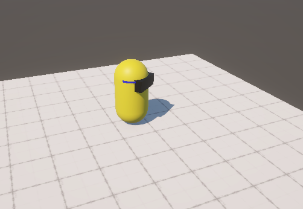

# Global Game Jam 2026 Game!




**Title:** [Your Game Title]  
**Team:** [Team Name]  
**Jam Site:** Edmonton, AB, Canada 
**Theme:** [Jam Theme]

## Directory Structure

Your submission ZIP should include these items:

```
/release/
/src/
/docs/
/screenshots/
/video/
license.txt
README.md
```

## /release/

Contains the **playable game build**, ready to run:

- Desktop executable(s) (Windows, Mac, Linux)  
- Browser build (HTML, JS, WASM) if applicable  
- All files needed for the game to launch

Make sure it can be launched with minimal setup. [global-game-jam.gitbook.io](https://global-game-jam.gitbook.io/ggj-manual/during-the-event-itself/creating-projects-and-uploading-games/upload-tips)

## /src/

Contains the **source files and project data** created during the jam:

- Engine or project files (Unity, Godot, etc.)  
- Editable source code (.cs, .gd, .js, etc.)  
- Original art and audio files

Uploading source on the GGJ platform is optional but recommended for archiving and sharing. [globalgamejam.org](https://globalgamejam.org/news/updating-license-terms-ggj-game-submissions)

## /docs/

Optional supporting files:

- Controls and instructions  
- Game design notes  
- Known issues

## Screenshots & Video

Put screenshots in `/screenshots/` and any video or link in `/video/`. These help others understand your game quickly. [globalgamejam.org](https://globalgamejam.org/upload-your-game)

## How to Run

**Desktop:**  

1) Extract the ZIP  
2) Open `/release/`  
3) Run the appropriate executable

**Browser:**  

1) Open `index.html` in a browser

Add platform specific notes if needed.

## Credits

```
[Name] – Role (e.g. programming)  
[Name] – Role (e.g. art)  
[Name] – Role (e.g. audio)
```

## Attributions

List tools, engines, or third-party content with licenses here:

```
Unity – https://unity.com  
[Asset Name] – licensed under [License]
```

## License

Team grants **perpetual right for GGJ to host this game submission**. You may choose any license that fits your content (e.g. MIT, Creative Commons), as long as required rights are granted. [globalgamejam.org](https://globalgamejam.org/news/updating-license-terms-ggj-game-submissions)

```
[License Name]  
[Link or full text]
```

## Notes

Any special build or platform info:

```
e.g. WebGL build requires a web server environment
```
